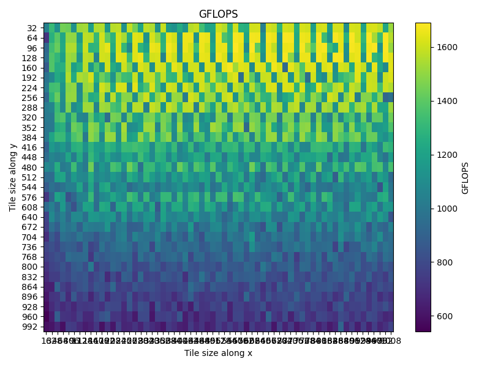

## Table of Contents

- [Analysis of the CPU](#analysis-of-the-cpu)
	- [Theoretical limitations of CPU](#theoretical-limitations-of-cpu)
	- [Practical limitations of CPU](#practical-limitations-of-cpu)
	- [Comparison with CP3B Solution](#comparison-with-cp3b-solution)
- [Analysis of the GPU](#analysis-of-the-gpu)
	- [Theoretical limitations of GPU](#theoretical-limitations-of-gpu)
	- [Practical limitations of GPU](#practical-limitations-of-gpu)
	- [Comparison with CP5 Solution](#comparison-with-cp5-solution)

The [README.md](./README.md) and [report.pdf](./report.pdf) are exactly the same infact to generate the report the readme was converted to tex using pandoc. So prefer reading the markdown

# Analysis of the CPU

## Theoretical limitations of CPU

For the cpu running `lscpu` gives
```bash
Architecture:             x86_64
  CPU op-mode(s):         32-bit, 64-bit
  Address sizes:          46 bits physical, 48 bits virtual
  Byte Order:             Little Endian
CPU(s):                   24
  On-line CPU(s) list:    0-23
Vendor ID:                GenuineIntel
  Model name:             13th Gen Intel(R) Core(TM) i7-13700K
    CPU family:           6
    Model:                183
    Thread(s) per core:   2
    Core(s) per socket:   16
    Socket(s):            1
    Stepping:             1
    CPU max MHz:          5400.0000
    CPU min MHz:          800.0000
    BogoMIPS:             6835.20
    Flags:                avx avx2 avx_vnni fma ...
Caches (sum of all):      
  L1d:                    640 KiB (16 instances)
  L1i:                    768 KiB (16 instances)
  L2:                     24 MiB (10 instances)
  L3:                     30 MiB (1 instance)
NUMA:                     
  NUMA node(s):           1
  NUMA node0 CPU(s):      0-23
````

It shows that the cpu is 13th Gen Intel(R) Core(TM) i7-13700K and has 16 cores and 24 threads, looking more into the [intel doc](https://www.intel.com/content/www/us/en/products/sku/230500/intel-core-i713700k-processor-30m-cache-up-to-5-40-ghz/specifications.html) of i7-13700K it has 8 performant cores (with hyper threading of 2) and 8 efficient cores. For the P-cores it has a base frequency of 3.4GHz and turbo frequency of 5.3 GHz while for the E-cores it has a base frequency of 2.5GHz and turbo frequency of 4.2GHz

The i7-13700K operates at a default frequency of [3.4GHz](https://www.techpowerup.com/cpu-specs/core-i7-13700k.c2850). Since it supports avx2 and each p cores can do 2 inst/cycle on ports 0 and 1 we can achieve 2 × 8 (8 sp per 256bit vector) × 2 (2 flops per fma) = 32 flops/cycle. For 8 p cores we can achieve at max 8 × 32 × 5.3 GHz = 1356.8 GFLOP/s at turbo frequency

For each e core we achieve 16 flops/cycle and thus we can achieve at max 8 × 16 × 4.2 GHz = 537.6 GFLOP/s at turbo frequency

Total we can achieve a max flops of 1894.4 GFLOP/s

Doing a similar analysis for double precision the number of doubles we can fit in avx256 would be effectively halved and we can fidn the theoretical maximum flops for doubles to be around 947.2 GFLOP/s

\[1] - [13th Gen Intel (R) Core(TM) i7-13700K](https://www.intel.com/content/www/us/en/products/sku/230500/intel-core-i713700k-processor-30m-cache-up-to-5-40-ghz/specifications.html)

\[2] - [Default clock freq of i7-13700K](https://www.techpowerup.com/cpu-specs/core-i7-13700k.c2850)

## Practical limitations of CPU

For evaluating the practical limitations of the cpu we will load an 8 element vector `a` into an avx256 register `a8` and broadcast a scalar `b` into another avx256 register `b8`. Then we perform fused multiply and add operation `d8[k] = a8 * b* + d8[k]` for each of the 8 lanes while repeating this `MN` times in parallel. This code does a total of \$128MN + 64N\$ flops, since M is of the order of `1e5` we will ignore the `64N`. This gives us a total of `128MN` flops. Here is the snippet of the main code

```cpp
#pragma omp parallel for schedule(dynamic, 1)
for (uint64_t i = 0; i < M; i++) {

    __m256 d8[8] = {};
    for(int k=0; k<8; k++) {
        // randomly initialize d8[k]
        alignas(32) float v[8] = {};
        for (int j = 0; j < 8; j++) v[j] = rand() / float(RAND_MAX) * 2.0f - 1.0f;
        d8[k] = _mm256_load_ps(v);
    }
    for (uint64_t j = 0; j < N; j++) {
        #pragma unroll
        for(int k=0; k<8; k++) {
            d8[k] = _mm256_fmadd_ps(a8, b8, d8[k]);
        }
    }

    // Since N is much larger the flops of this is negligible
    __m256 s = _mm256_setzero_ps();
    for(int i=0; i<8; i++) {
        s = _mm256_add_ps(s, d8[i]);
    }
    out[i] += s[0];
}
```

We time how long it takes to run this using `std::chrono::high_resolution_clock` and we will also measure the clock cycles during it's execution using `__rdtscp` intrinsics this will help us get the measured clock freq. We take an average of 5 runs for reporting the wall clock time and the cpu cycles and thus the clock freq and the measured GSLOP/s. The entire code is at [cpu\_flops.cpp](./cpu_flops.cpp), we will run this with the following flags enabled

```bash
export OMP_NUM_THREADS=24

g++ -fopenmp -g -O3 -march=native cpu_flops.cc -o main

perf stat ./main
```

Running it prints the following

```bash
Avg Wall time        : 3.50322 s
Total FLOPs          : 6400 GFLOP
Avg Achieved FLOP    : 1826.89 GFLOP/s
Cycles elapsed       : 11972383729
Measured CPU freq    : 3.41753 GHz
sum                  : 2.05752

 Performance counter stats for './main':

         80,781.54 msec task-clock                #   23.051 CPUs utilized          
             2,372      context-switches          #   29.363 /sec                   
               159      cpu-migrations            #    1.968 /sec                   
               393      page-faults               #    4.865 /sec                   
   389,859,205,718      cycles                    #    4.826 GHz                    
   500,717,583,488      instructions              #    1.28  insn per cycle         
    50,156,378,434      branches                  #  620.889 M/sec                  
         1,403,191      branch-misses             #    0.00% of all branches        

       3.504431292 seconds time elapsed

      80.759760000 seconds user
       0.023995000 seconds sys
```

We also print the sum of output after the exectution so the compiler does not optimize away everything. The main things to see is we achieve 1826.89 GFLOP/s and measured a clock freq of 4.826 GHz, there is also a huge difference between the clock frequencies measured by perf and \_\_rdtscp. The reason could be \_\_rdtscp does not vary according to the current core's frequency. Infact after reading more about it from [Time\_Stamp\_Counter](https://en.wikipedia.org/wiki/Time_Stamp_Counter) I came to realize it's use is highly discouraged. We achieved 96.43% of the theoretical peak flops. I think this is the practical best performance we can achieve as we never get the clock to run at turbo freq for all p and e core for all the avx256 instruction and there will be some dips in the clock freq degrading performance

Only running the [cpu\_flops.cpp](./cpu_flops.cpp) on the p cores using

```bash
export OMP_NUM_THREADS=16
export OMP_PLACES="{0,1,2,3,4,5,6,7,8,9,10,11,12,13,14,15}"
export OMP_PROC_BIND=close

g++ -fopenmp -g -O3 -march=native cpu_flops.cc -o main

./main
```

gives us

```bash
Avg Wall time        : 4.79077 s
Total FLOPs          : 6400 GFLOP
Avg Achieved FLOP    : 1335.9 GFLOP/s
Cycles elapsed       : 16372601962
Measured CPU freq    : 3.41753 GHz
sum                  : 2.05752
```

Thus the p cores can reach 99.93% of their peak flops. while running it only on the e cores using

```bash
export OMP_NUM_THREADS=8
export OMP_PLACES="{16,17,18,19,20,21,22,23}"
export OMP_PROC_BIND=close

g++ -fopenmp -g -O3 -march=native cpu_flops.cc -o main

./main
```

gives us

```bash
Avg Wall time        : 11.9549 s
Total FLOPs          : 6400 GFLOP
Avg Achieved FLOP    : 535.346 GFLOP/s
Cycles elapsed       : 40856183393
Measured CPU freq    : 3.41753 GHz
sum                  : 2.05752
```

which is also 99.50% of the theoretical max that the e cores can achieve, I don't have any definite answers as to why only individually e cores and p cores are able to achieve max flops while together they fall short by 2-3% but maybe they cannot be sustained at turbo freq all the time under avx256

Looking at generated assembly code from [cpu\_flops.s](./cpu_flops.s) we see that the compiler has generated the 8 fma256 instruction for us

```assembly
.L4:
	vfmadd231ps	%ymm0, %ymm1, %ymm2
	vfmadd231ps	%ymm0, %ymm1, %ymm9
	vfmadd231ps	%ymm0, %ymm1, %ymm8
	vfmadd231ps	%ymm0, %ymm1, %ymm7
	vfmadd231ps	%ymm0, %ymm1, %ymm6
	vfmadd231ps	%ymm0, %ymm1, %ymm5
	vfmadd231ps	%ymm0, %ymm1, %ymm4
	vfmadd231ps	%ymm0, %ymm1, %ymm3
	subq	$1, %rax
	jne	.L4
```

## Comparison with CP3B Solution

For comparison with my fastest cp3b solution, we use the exact same code as the [137707](https://ppc-exercises.cs.aalto.fi/course/aalto2025/cp/cp3b/137707) submission with replacing the avx512 instructions with avx256 and adding code for timing measurements and clock freq measurements. We set nx and ny to be 14000. On running

```
export OMP_NUM_THREADS=24

g++ -fopenmp -g -O3 -march=native cp3b.cc -o main

perf stat ./main
```

we see the following output

```
Wall time            : 1.73274 s
Total FLOPs          : 2744 GFLOP
Achieved FLOPS       : 1583.62 GFLOP/s
Cycles elapsed       : 5921721988
Measured CPU freq    : 3.41756 GHz
Checksum             : -0.00906668

 Performance counter stats for './main':

         45,399.47 msec task-clock                #   11.634 CPUs utilized          
               689      context-switches          #   15.176 /sec                   
                25      cpu-migrations            #    0.551 /sec                   
           683,659      page-faults               #   15.059 K/sec                  
   206,358,697,147      cycles                    #    4.545 GHz                    
   386,717,416,506      instructions              #    1.87  insn per cycle         
    15,785,912,832      branches                  #  347.711 M/sec                  
        62,951,893      branch-misses             #    0.40% of all branches        

       3.902154516 seconds time elapsed

      44.625873000 seconds user
       0.776241000 seconds sys
```

We achieved 83.59% of the theoretical peak flops

Now again inspecting the assembly at [cp3b.s](./cp3b.s) we see the compiler did the right thing and generated the vectorized code for us. The assembly code for the innermost loop of the kernel looks like this

```assembly
.L115:
	vmovaps	(%r8), %ymm1
	vbroadcastss	(%rdx), %ymm2
	addq	$32, %rdx
	vmovaps	(%r8,%rcx,4), %ymm0
	addq	$32, %r8
	vfmadd231ps	%ymm2, %ymm1, %ymm4
	vfmadd213ps	192(%rsp), %ymm0, %ymm2
	vmovaps	%ymm2, 192(%rsp)
	vbroadcastss	-28(%rdx), %ymm2
	vfmadd231ps	%ymm2, %ymm1, %ymm9
	vfmadd213ps	128(%rsp), %ymm0, %ymm2
	vmovaps	%ymm2, 128(%rsp)
	vbroadcastss	-24(%rdx), %ymm2
	vfmadd231ps	%ymm2, %ymm1, %ymm8
	vfmadd231ps	%ymm2, %ymm0, %ymm15
	vbroadcastss	-20(%rdx), %ymm2
	vfmadd231ps	%ymm2, %ymm1, %ymm7
	vfmadd231ps	%ymm2, %ymm0, %ymm11
	vbroadcastss	-16(%rdx), %ymm2
	vfmadd231ps	%ymm2, %ymm1, %ymm6
	vfmadd231ps	%ymm2, %ymm0, %ymm10
	vbroadcastss	-12(%rdx), %ymm2
	vfmadd231ps	%ymm2, %ymm1, %ymm5
	vfmadd231ps	%ymm2, %ymm0, %ymm14
	vbroadcastss	-8(%rdx), %ymm2
	vfmadd231ps	%ymm2, %ymm1, %ymm3
	vfmadd231ps	%ymm2, %ymm0, %ymm13
	vbroadcastss	-4(%rdx), %ymm2
	vfmadd213ps	160(%rsp), %ymm2, %ymm1
	vfmadd231ps	%ymm2, %ymm0, %ymm12
	vmovaps	%ymm1, 160(%rsp)
	cmpq	%rsi, %rdx
	jne	.L115
```
There are 2 instructions for loop counters, 2 for pointer arithematic, 8 for memory access, 8 for the boradcast operation and 16 for the actual fma operations

When on experimentation with different tile sizes we find that a tile size of Mc=Nc=96 and Kc=560 gives us 1690.02 GFLOP/s, which is 89.92% of the theoretical peak flops and 6% increase from the untuned matmul kernel, plot the heatmap of tile size along x and y shows a pattern that when one a tile can fit in the L2 cache (MC * KC  * 4 bytes per float<= 24MB/10 (we have 10 instances)) we get high performance but as soon as the tile exceeds the per core L2 the performance starts degrading significantly


The data from tuning is at [tuning_results.csv](./tuning_results.csv) and the python script for generating the benchmarks and plotting are at [autotune.py](./autotune.py) and [plot_heatmap.py](./plot_heatmap.py)

# Analysis of the GPU

## Theoretical limitations of GPU

For the GPU running `nvcc device_query.cpp -o main && ./main` gives
```bash
Name: NVIDIA GeForce RTX 2050
Compute Capability: 8.6
Clock Rate: 1.155 GHz 
Max threads per block: 1024
Max threads per multiprocessor: 1536
Threads per warp: 32
Max registers per block: 65536
Max registers per multiprocessor: 65536
Total global memory: 3897 MB
Max shared mem per block: 48 KB
Shared mem per multiprocessor: 102400 B
Multiprocessor count: 16
Max warps per multiprocessor: 48
```
Thus we have the Nvidia GeForce RTX 2050 as our GPU for this analysis which is based on turing architecture. It has 16 streaming multiprocessors (SM) and from the wiki of [GeForce RTX 2050](https://en.wikipedia.org/wiki/GeForce_RTX_20_series#Laptop) it has 2048 CUDA cores and 64 Tensor Cores. It also has a bandwidth of 112 GB/s and a default clock freq of 1.155 GHz and boost of 1.477 GHz. Each core can execute 1 fma i.e 2 FLOP per cycle, we can then calculate the theoretical max flops as follows

$$
\begin{aligned}
\text{SP peak @ base} 
&= 2048 \times 2 \times 1.155\!\times\!10^9 
\approx 4730.88\;\mathrm{GFLOP/s}\\
\text{SP peak @ boost} 
&= 2048 \times 2 \times 1.477\!\times\!10^9 
\approx 6049.79\;\mathrm{GFLOP/s}
\end{aligned}
$$

This matches with the processing power @ boost in the wiki of GeForce 2050

[1] - [Nvidia GeForce RTX datasheet](https://www.techpowerup.com/gpu-specs/geforce-rtx-2050-mobile.c3859)

[2] - [RTX Series comparison](https://www.nvidia.com/fi-fi/geforce/gaming-laptops/compare-20-series/)

## Practical limitations of GPU

For doing max computation on gpu we will let each thread execute $N$ fma i.e each thread will compute $a = a *b + a$. Each thread then does a total of $2 * N$ flops which will allow the entire kernel to do blocks * threads * 2 * N flops. Here is our very simple and tiny kernel, the entire code is available at [max_flops.cu](max_flops.cu)
```cpp
extern "C" __global__
void gpu_kernel(
    float *out,
    int N, float seed
) {

    int tid = threadIdx.x;
    float a = seed + tid;
    float b = seed - tid;

    for (int i = 0; i < N; i++) {
        a = a * b + a;
    }

    out[blockIdx.x * blockDim.x + tid] = a;
}

gpu_kernel<<<1024, 256>>>(
    d_out, iters, seed
);
```

We run this with `nvcc max_flops.cu -O3 -arch=sm_86 -o main && ./main` with N set to `1e7` and it gives the following output
```bash
Elapsed Time : 1132.182 ms (1.132 s)
 Total FLOP  : 5.243e+03 GFLOP
Performance  : 4630.773 GFLOP/s
```

We thus achieve 97.88% of the theoretical maximum flops. Profiling it with `sudo ncu ./main` gives us
```bash
gpu_kernel (1024, 1, 1)x(256, 1, 1), Context 1, Stream 7, Device 0, CC 8.6
    Section: GPU Speed Of Light Throughput
    ----------------------- ------------- ----------------
    Metric Name               Metric Unit     Metric Value
    ----------------------- ------------- ----------------
    DRAM Frequency          cycle/nsecond             6.00
    SM Frequency            cycle/usecond           832.57
    Elapsed Cycles                  cycle    1,532,524,284
    Memory Throughput                   %             0.06
    DRAM Throughput                     %             0.00
    Duration                       second             1.13
    L1/TEX Cache Throughput             %             0.00
    L2 Cache Throughput                 %             0.06
    SM Active Cycles                cycle 1,532,183,860.38
    Compute (SM) Throughput             %            99.18
    ----------------------- ------------- ----------------

    INF   The kernel is utilizing greater than 80.0% of the available compute or memory performance of the device. To   
          further improve performance, work will likely need to be shifted from the most utilized to another unit.      
          Start by analyzing workloads in the Compute Workload Analysis section.                                        

    Section: Launch Statistics
    -------------------------------- --------------- ---------------
    Metric Name                          Metric Unit    Metric Value
    -------------------------------- --------------- ---------------
    Block Size                                                   256
    Function Cache Configuration                     CachePreferNone
    Grid Size                                                  1,024
    Registers Per Thread             register/thread              16
    Shared Memory Configuration Size           Kbyte            8.19
    Driver Shared Memory Per Block       Kbyte/block            1.02
    Dynamic Shared Memory Per Block       byte/block               0
    Static Shared Memory Per Block        byte/block               0
    Threads                                   thread         262,144
    Waves Per SM                                               10.67
    -------------------------------- --------------- ---------------

    Section: Occupancy
    ------------------------------- ----------- ------------
    Metric Name                     Metric Unit Metric Value
    ------------------------------- ----------- ------------
    Block Limit SM                        block           16
    Block Limit Registers                 block           16
    Block Limit Shared Mem                block            8
    Block Limit Warps                     block            6
    Theoretical Active Warps per SM        warp           48
    Theoretical Occupancy                     %          100
    Achieved Occupancy                        %        95.84
    Achieved Active Warps Per SM           warp        46.00
    ------------------------------- ----------- ------------

    INF   This kernel's theoretical occupancy is not impacted by any block limit.          
```
We can see that our kernel achieved a compute capacity of `99.18%` which is all thanks to ~0% memory utilization. We also achieved 95.84% of max occupancy with 46 active warps out of 48

Looking at the ptx code with `nvcc --ptx -arch=sm_86 max_flops.cu -o main.ptx` we see that the compiler directly generated fma f32 instructions while unrolling the inner loop by 4 for us
```assembly
$L__BB0_3:
	fma.rn.f32 	%f13, %f2, %f20, %f20;
	fma.rn.f32 	%f14, %f2, %f13, %f13;
	fma.rn.f32 	%f15, %f2, %f14, %f14;
	fma.rn.f32 	%f20, %f2, %f15, %f15;
	add.s32 	%r13, %r13, -4;
	setp.ne.s32 	%p3, %r13, 0;
	@%p3 bra 	$L__BB0_3;
```
The executable can be found at [max_flops](max_flops) and the ptx code at [max_flops.ptx](max_flops.ptx)

## Comparison with CP5 Solution

Now for comparison with the fastest [cp5.cu](cp5.cu) solution we again benchmark using `nvcc cp5.cu -O3 -arch=sm_86 -o main && ./main`. It follows the exact same code as submitted to cp5 without any modification and nx and ny set to `14000`, the executable can be found at [cp5](cp5)
```cpp
Elapsed Time : 1050.230 ms (1.050 s)
 Total FLOP  : 2.744e+03 GFLOP
Performance  : 2612.948 GFLOP/s
```
It executated $2\times 14\times 14\times 14  / 2= 2744$ GFLOP (as we are only computing the upper triangular matrix) in 1.050s achieving 2612.948 GFLOP/s which is 55.23% of the theoretical peak flops @ base. Profiling it with `sudo ncu ./main` reveals

```bash
matmul_kernel_v3 (110, 110, 1)x(16, 16, 1), Context 1, Stream 7, Device 0, CC 8.6
    Section: GPU Speed Of Light Throughput
    ----------------------- ------------- ----------------
    Metric Name               Metric Unit     Metric Value
    ----------------------- ------------- ----------------
    DRAM Frequency          cycle/nsecond             6.00
    SM Frequency            cycle/usecond           832.53
    Elapsed Cycles                  cycle    1,069,374,085
    Memory Throughput                   %            56.61
    DRAM Throughput                     %            54.71
    Duration                       second             1.28
    L1/TEX Cache Throughput             %            56.73
    L2 Cache Throughput                 %            33.48
    SM Active Cycles                cycle 1,067,132,546.81
    Compute (SM) Throughput             %            69.46
    ----------------------- ------------- ----------------

    WRN   Compute is more heavily utilized than Memory: Look at the Compute Workload Analysis section to see what the   
          compute pipelines are spending their time doing. Also, consider whether any computation is redundant and      
          could be reduced or moved to look-up tables.                                                                  

    Section: Launch Statistics
    -------------------------------- --------------- ---------------
    Metric Name                          Metric Unit    Metric Value
    -------------------------------- --------------- ---------------
    Block Size                                                   256
    Function Cache Configuration                     CachePreferNone
    Grid Size                                                 12,100
    Registers Per Thread             register/thread             100
    Shared Memory Configuration Size           Kbyte           65.54
    Driver Shared Memory Per Block       Kbyte/block            1.02
    Dynamic Shared Memory Per Block       byte/block               0
    Static Shared Memory Per Block       Kbyte/block            8.19
    Threads                                   thread       3,097,600
    Waves Per SM                                              378.12
    -------------------------------- --------------- ---------------

    Section: Occupancy
    ------------------------------- ----------- ------------
    Metric Name                     Metric Unit Metric Value
    ------------------------------- ----------- ------------
    Block Limit SM                        block           16
    Block Limit Registers                 block            2
    Block Limit Shared Mem                block            7
    Block Limit Warps                     block            6
    Theoretical Active Warps per SM        warp           16
    Theoretical Occupancy                     %        33.33
    Achieved Occupancy                        %        33.30
    Achieved Active Warps Per SM           warp        15.98
    ------------------------------- ----------- ------------

    WRN   This kernel's theoretical occupancy (33.3%) is limited by the number of required registers. See the CUDA Best 
          Practices Guide (https://docs.nvidia.com/cuda/cuda-c-best-practices-guide/index.html#occupancy) for more      
          details on optimizing occupancy.                                                                   
```

This time we achieved 70% of max compute throughput and only 33% max theoretical occupancy which is due to high register use of 100 per thread and 16 active warps per block possible and also our memory throughput is 55% of peak. Thus we are register bound

Looking at the ptx code from [cp5.ptx](cp5.ptx) we see that the compiler issues vectorized loads from shared memory this time
```assembly
	fma.rn.f32 	%f701, %f636, %f617, %f605;
	fma.rn.f32 	%f702, %f636, %f618, %f606;
	fma.rn.f32 	%f703, %f636, %f619, %f607;
	fma.rn.f32 	%f704, %f636, %f620, %f608;
	ld.shared.v4.f32 	{%f705, %f706, %f707, %f708}, [%r74+2048];
	ld.shared.v4.f32 	{%f713, %f714, %f715, %f716}, [%r74+2304];
	ld.shared.v4.f32 	{%f721, %f722, %f723, %f724}, [%r77+2048];
	ld.shared.v4.f32 	{%f729, %f730, %f731, %f732}, [%r77+2304];
	fma.rn.f32 	%f737, %f721, %f705, %f641;
	fma.rn.f32 	%f738, %f721, %f706, %f642;
	fma.rn.f32 	%f739, %f721, %f707, %f643;
```

not only that we can also see that the compiler also generated code for vectorized load from global to shared memory
```assembly
$L__BB1_3:
	.loc	1 108 9
	ld.global.nc.v4.u32 	{%r56, %r57, %r58, %r59}, [%rd39];
	st.shared.v4.u32 	[%r6], {%r56, %r57, %r58, %r59};
	.loc	1 109 9
	ld.global.nc.v4.u32 	{%r64, %r65, %r66, %r67}, [%rd38];
	st.shared.v4.u32 	[%r5], {%r64, %r65, %r66, %r67};
```